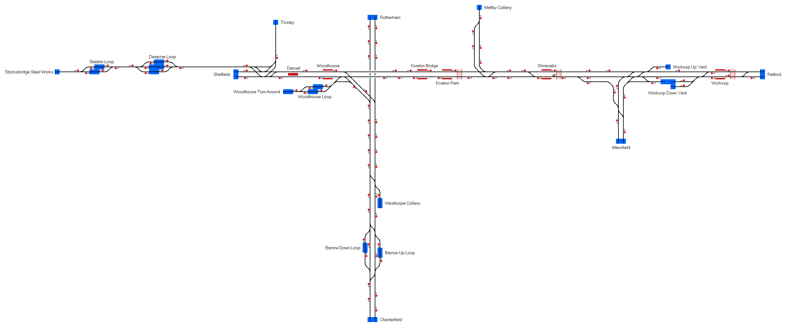

# Sheffield East
A small route covering the line from Sheffield to Worksop, including branches to Chesterfield and Stocksbridge.

## Current Status

| Stage         | Status        |
| ------------- |:-------------:|
| Track Plan     | :heavy_check_mark: |
| Signalling      | :heavy_check_mark:      |
| Naming | :heavy_check_mark:      |
| Speed Limits | :heavy_check_mark: |
| Distances | :heavy_check_mark: |
| Timetable | :heavy_check_mark: |
| Documentation | :heavy_check_mark: |

## Data Sources

- [OpenStreetMap](https://www.openstreetmap.org/#map=11/53.3522/-1.2476)
- [Meurisse](https://map.meurisse.org/)
